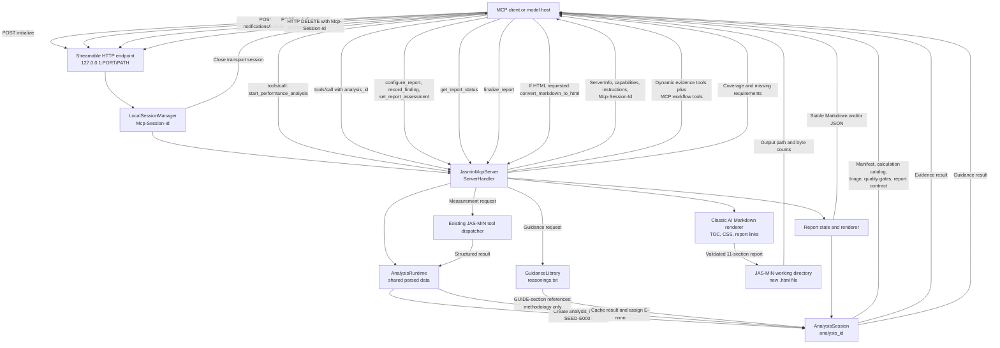
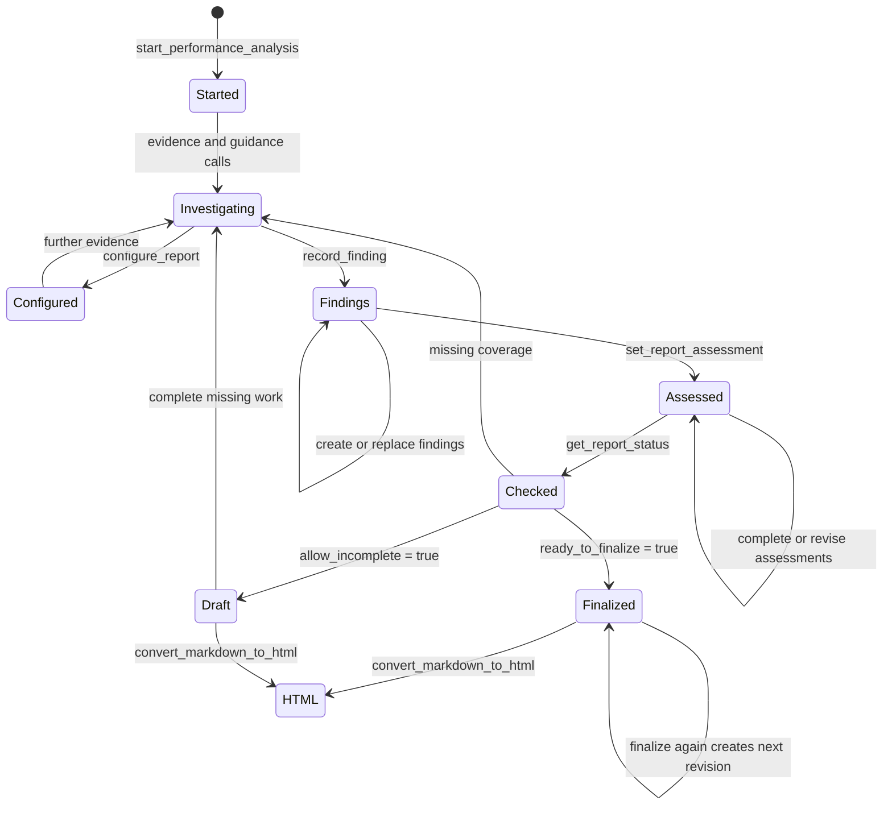

# JAS-MIN MCP Server

JAS-MIN can expose a parsed Oracle AWR or STATSPACK collection as a stateful
Model Context Protocol (MCP) server. The server is intended for interactive,
evidence-backed performance investigations: a model receives a compact map of
the available statistics, requests focused evidence, records conclusions with
explicit references, and asks JAS-MIN to render a report with a stable
structure.

The MCP mode reuses the same analytical data structures and diagnostic tools as
the existing AI integrations. It does not implement a second parser or a
parallel analysis engine.

## Design goals

The server is built around the following constraints:

- parsing and statistical analysis finish before the endpoint starts listening;
- large AWR collections remain in memory and are queried through bounded tools;
- the first analysis call teaches the model what JAS-MIN has already computed;
- observed data, diagnostic methodology, and model-authored conclusions remain
  separate;
- every report conclusion can refer to evidence collected in the same analysis;
- the final report has a deterministic core structure, while its language,
  audience, detail, and appendices remain configurable;
- missing data remains `unknown` instead of being silently interpreted as an
  absent problem;
- the built-in listener is local-only and does not pretend to provide
  authentication or transport security.

## Starting the server

Parse a directory and start MCP:

```bash
jas-min --directory ./awr_reports --security-level 2 \
  --mcp 127.0.0.1:4242/mcp
```

Reuse an existing serialized collection:

```bash
jas-min --json-file ./awr_reports.json --security-level 2 \
  --mcp 127.0.0.1:4242/mcp
```

The argument has the form `IP:PORT/PATH`. If the path is omitted, `/mcp` is
used. An `http://` prefix is accepted, but `https://` is rejected because the
embedded server does not terminate TLS.

Only loopback addresses are accepted. For example,
`127.0.0.1:4242/mcp` is valid, while `0.0.0.0:4242/mcp` is rejected. Remote
access must be provided by a trusted proxy that adds TLS, authentication, and an
appropriate authorization policy.

The `--file` input mode cannot be combined with `--mcp`. A single parsed report
does not provide the complete time-series collection required by the tool
layer.

The minimum supported Rust version for this feature is 1.88.

## Startup architecture

JAS-MIN performs the following work synchronously before binding the TCP
listener:

1. Parse the input directory or deserialize the requested JSON collection.
2. Build the full `AWRSCollection` time series.
3. Calculate the compact `ReportForAI`, including degradation, correlations,
   gradients, anomalies, waits, SQL, I/O, latch, segment, and parameter
   summaries.
4. Resolve the dataset stem used to discover sibling attachments.
5. Load and index diagnostic guidance from `reasonings.txt`.
6. Construct `AnalysisRuntime` with immutable shared data and an empty analysis
   session map.
7. Bind the loopback listener and mount the Streamable HTTP service at the
   configured path.

The runtime retains the following objects until the process exits:

| Object | Storage | Purpose |
|---|---|---|
| `AWRSCollection` | shared `Arc` | Complete parsed Oracle time series and SQL/parameter data. |
| `ReportForAI` | shared `Arc` | Precomputed and bounded statistical summaries. |
| Dataset stem | shared `Arc` | Locates `<stem>_attachments` and its AIX subdirectory. |
| Guidance library | shared `Arc` | Indexed sections loaded from `reasonings.txt`. |
| Analysis sessions | concurrent `DashMap` | Evidence, guidance references, findings, assessments, and report configuration keyed by `analysis_id`. |
| Analysis sequence | atomic counter | Generates unique process-local analysis identifiers. |

The parsed collection and precomputed report are immutable after startup.
Conversational state is isolated in per-analysis records protected by a mutex.

## Request flow

The following graph shows the normal request path and the boundary between the
MCP transport session and the JAS-MIN analysis session.



An evidence tool request is processed in this order:

1. The Streamable HTTP layer validates and routes the JSON-RPC request.
2. `JasminMcpServer` resolves the tool and passes its arguments to
   `AnalysisRuntime`.
3. The runtime requires a non-empty `analysis_id` and locates the corresponding
   `AnalysisSession`.
4. The runtime removes `analysis_id` before calling the existing JAS-MIN
   dispatcher, so MCP-specific state never changes the legacy tool contract.
5. A tool-native error is returned immediately and is not registered as
   evidence.
6. Successful arguments are canonicalized. Object key order therefore does not
   affect cache identity.
7. An identical successful call in the same analysis reuses its existing
   evidence record; otherwise the result receives the next `E-nnnn` identifier.
8. The result is returned as MCP structured content together with its
   `analysis_id`, `evidence_id`, tool name, and cache status.

## Transport lifecycle

The endpoint uses stateful MCP over Streamable HTTP. A client normally performs
this lifecycle automatically:

1. Send `initialize` with the client name, version, capabilities, and supported
   protocol version.
2. Read the negotiated server information and `Mcp-Session-Id` response header.
3. Send `notifications/initialized` with that session header.
4. Discover `tools/list` and, if useful, `prompts/list` or `prompts/get`.
5. Call `start_performance_analysis`.
6. Use the returned `analysis_id` in every later JAS-MIN tool call.
7. End the transport session with HTTP `DELETE` and the
   `Mcp-Session-Id` header.

Minimal initialization request:

```bash
curl -i -X POST http://127.0.0.1:4242/mcp \
  -H 'Accept: application/json, text/event-stream' \
  -H 'Content-Type: application/json' \
  --data '{
    "jsonrpc": "2.0",
    "id": 1,
    "method": "initialize",
    "params": {
      "protocolVersion": "2025-06-18",
      "capabilities": {},
      "clientInfo": {"name": "manual-test", "version": "1.0"}
    }
  }'
```

Use the version negotiated in the response rather than assuming that the
example version will remain current.

After initialization, include the returned session header in every transport
request:

```text
Mcp-Session-Id: <transport-session-id>
```

Close the transport session when it is no longer needed:

```bash
curl -i -X DELETE http://127.0.0.1:4242/mcp \
  -H 'Mcp-Session-Id: <transport-session-id>'
```

### Transport session versus analysis session

`Mcp-Session-Id` and `analysis_id` are deliberately different identifiers.

| Identifier | Created by | Scope | Lifetime |
|---|---|---|---|
| `Mcp-Session-Id` | MCP Streamable HTTP transport | Protocol negotiation and HTTP transport state. | Until HTTP `DELETE`, transport expiry, or process exit. |
| `analysis_id` | `start_performance_analysis` | Evidence, guidance references, report configuration, findings, assessments, and revisions. | Until JAS-MIN exits. |

Deleting an MCP transport session does not currently delete its JAS-MIN
analysis. Analysis sessions are process-local, have no persistence, and are not
restored after restart. Because the runtime is shared, an `analysis_id` can be
used from another valid local MCP transport session while the process is still
running. Treat both identifiers as sensitive local handles, not as
authentication credentials.

## Server capabilities and onboarding

The server advertises MCP `tools` and `prompts` capabilities. Model onboarding
is distributed across three mechanisms:

1. **Server instructions** define mandatory evidence discipline and report
   completion rules.
2. **`oracle_performance_analysis` prompt** provides a reusable tool-first user
   message with optional `language` and `focus` arguments.
3. **`start_performance_analysis` tool** creates the analysis session and
   returns a dataset-specific map of available calculations and evidence.

This avoids placing the entire `ReportForAI`, raw snapshots, attachments, and
`reasonings.txt` into an initial prompt. The model learns what can be calculated
immediately, but retrieves the expensive detail only when a hypothesis requires
it.

### Optional MCP prompt

The prompt can be requested by name:

```json
{
  "jsonrpc": "2.0",
  "id": 2,
  "method": "prompts/get",
  "params": {
    "name": "oracle_performance_analysis",
    "arguments": {
      "language": "EN",
      "focus": "DB Time degradation and cursor contention"
    }
  }
}
```

The prompt is guidance for the model host. It does not create an analysis
session and does not replace `start_performance_analysis`.

## Analysis bootstrap

`start_performance_analysis` is the only JAS-MIN tool that does not require an
existing `analysis_id`.

Example call:

```json
{
  "jsonrpc": "2.0",
  "id": 3,
  "method": "tools/call",
  "params": {
    "name": "start_performance_analysis",
    "arguments": {
      "focus": "Investigate DB Time degradation and cursor contention",
      "language": "EN",
      "audience": "mixed"
    }
  }
}
```

The returned structured payload contains:

| Field | Meaning |
|---|---|
| `schema_version` | Version of the JAS-MIN MCP analysis contract. |
| `analysis_id` | Required handle for every later tool call. |
| `seed_evidence_id` | `SEED-E0001`, representing the bounded initial case seed. |
| `dataset_manifest` | Snapshot range, dates, instance metadata, security level, SQL/parameter counts, and attachment inventory. |
| `available_calculations` | Statistical methods, access tools, outputs, and interpretation caveats. |
| `case_seed` | Bounded high-signal summary derived from `ReportForAI`. |
| `triage_preview` | Small wait, SQL, I/O, latch, anomaly, and parameter indexes. |
| `diagnostic_guidance` | Catalog of indexed `reasonings.txt` sections, not their full contents. |
| `quality_gates` | Dataset- and platform-aware proof requirements. |
| `report_contract` | Stable sections, required finding categories, assessments, and current output configuration. |
| `recommended_next_calls` | Dataset-aware opening calls, including attachment tools when the relevant files exist. |

The bootstrap is intentionally bounded. It is a routing map, not a complete
performance report.

## Available statistical calculations

The bootstrap catalog describes both the calculation and the tool needed to
retrieve it:

- descriptive mean, median, standard deviation, occurrence percentage, and
  percentiles;
- DB CPU / DB Time workload composition;
- global and sliding-window median absolute deviation anomalies;
- temporal anomaly clusters;
- Pearson correlations;
- Ridge, Elastic Net, Huber, and Quantile-95 gradients;
- VIF and collinear-group diagnostics;
- robust baseline-versus-recent DB Time degradation;
- metric, wait-event, and SQL timelines;
- peak-versus-baseline snapshot comparison;
- wait-event latency histograms.

These values rank and shape hypotheses. They do not prove causation. In
particular:

- correlation requires temporal alignment and independent verification;
- gradient importance can be unstable for near-zero baselines or collinear
  predictors;
- an anomaly is a deviation from a baseline, not automatically a bottleneck;
- DB CPU / DB Time describes workload composition but cannot independently
  prove or dismiss AIX LPAR CPU pressure.

## Tool catalog construction

At startup, JAS-MIN converts the existing OpenAI/OpenRouter function schemas to
MCP tools. Each converted evidence schema receives a required `analysis_id`
property. The adapter also supplies a permissive object output schema and MCP
annotations:

- evidence and catalog reads are marked read-only and idempotent where
  appropriate;
- report mutations and analysis creation are not marked read-only;
- no tool is marked destructive;
- tools are marked closed-world because they operate only on the parsed
  collection, its local attachments, in-memory report state, and explicitly
  named new HTML files in the JAS-MIN working directory.

The core evidence catalog is always available. Attachment tools are registered
only when matching files are discovered under `<stem>_attachments`.

With no attachments the server exposes 21 core evidence tools and ten MCP
workflow tools. Every supported attachment class adds its own discovery or
inspection tools; a dataset containing plans, child-cursor reasons, an alert
log, and AIX telemetry exposes eight additional evidence tools.

### Core evidence tools

| Area | Tools |
|---|---|
| Global and point lookups | `get_database_load_summary`, `get_snapshot_details`, `get_sql_text`, `get_init_parameter`, `get_db_instance_info` |
| Snapshot aggregations | `list_snapshots`, `top_sqls_in_snapshot`, `top_wait_events_in_snapshot`, `top_segments_in_snapshot`, `top_latches_in_snapshot` |
| Search | `search_sql_text`, `find_sqls_touching_object`, `find_snapshots_with_event`, `find_snapshots_with_sql`, `find_sqls_by_module` |
| Timelines and comparison | `get_metric_time_series`, `get_wait_event_timeline`, `get_sql_timeline`, `compare_snapshots`, `get_wait_event_histogram` |
| Discovery | `list_available_metrics` |

### Conditional attachment tools

| Attachment | Discovery condition | Tools |
|---|---|---|
| SQL execution plans | At least one `*.xplan` file | `list_available_sql_plans`, `get_sql_execution_plan` |
| Child cursor reasons | At least one `.shared_cursor_reasons` file | `list_available_child_cursor_reasons`, `get_child_cursor_reasons` |
| Oracle alert log | At least one alert-log candidate | `get_alertlog_errors` |
| AIX telemetry | At least one supported file under `AIX/` | `list_aix_os_attachments`, `get_aix_os_attachment`, `get_aix_cpu_entitlement_summary` |

### MCP workflow tools

| Tool | State effect |
|---|---|
| `start_performance_analysis` | Creates an `AnalysisSession` and its seed evidence. |
| `get_analysis_catalog` | Repeats the current manifest, calculation catalog, guidance catalog, and report contract. |
| `get_precomputed_analysis` | Registers a requested `ReportForAI` section as evidence. |
| `get_diagnostic_guidance` | Registers methodology references, never evidence IDs. |
| `configure_report` | Updates report presentation settings. |
| `record_finding` | Creates or replaces an evidence-backed finding. |
| `set_report_assessment` | Stores one mandatory final assessment. |
| `get_report_status` | Validates report coverage without rendering it. |
| `finalize_report` | Validates and renders Markdown, JSON, or both. |
| `convert_markdown_to_html` | Validates finalized Markdown and creates a new HTML file in the working directory using the classic AI renderer. |

## Evidence registry

Every successful measurement tool call is wrapped in an evidence envelope:

```json
{
  "schema_version": "2026-08-05.1",
  "analysis_id": "A-20260804T100000Z-0001",
  "evidence_id": "E-0002",
  "tool_name": "get_database_load_summary",
  "cached": false,
  "result": {
    "...": "tool-specific structured data"
  }
}
```

`SEED-E0001` is created with the analysis bootstrap. Later successful evidence
calls use `E-0002`, `E-0003`, and so on.

Evidence identity is scoped to one `analysis_id`. A finding cannot cite an
evidence identifier from another analysis. Repeating the same tool with
canonically identical arguments reuses the existing identifier and returns
`"cached": true`.

The cache is an evidence registry, not a general response cache. The underlying
tool may still execute before a concurrent duplicate call observes the stored
record, but only one canonical evidence reference is retained for the session.

## Diagnostic guidance

JAS-MIN resolves `reasonings.txt` in this order:

1. `$JASMIN_HOME/reasonings.txt`;
2. `./reasonings.txt`.

The file is parsed into independently addressable sections. The bootstrap
returns only a catalog. `get_diagnostic_guidance` accepts either an exact
section such as `§1.1` or a concrete symptom and returns at most the requested
bounded number of matching sections.

Returned references use the form `GUIDE-§1.1`. They are recorded separately
from evidence and the response explicitly declares `methodology_only: true`.
This distinction is enforced when a finding or assessment is stored:

- `evidence_refs` must identify measurement results from the same analysis;
- `guidance_refs` must identify sections actually retrieved in that analysis;
- guidance can explain a diagnostic rule but cannot prove that its trigger is
  present in the dataset.

Symptom matching is token-based. For example, a query about `log file sync`
must not be routed to unrelated `LOGON STORMS` guidance merely because both
contain a similar character sequence.

## Recommended investigation workflow

A robust investigation normally follows this order:

1. Call `start_performance_analysis` and inspect the dataset manifest,
   calculation catalog, quality gates, and initial triage.
2. Establish the whole-window workload envelope with
   `get_database_load_summary`.
3. Retrieve `db_time_degradation` and `full_gradients` through
   `get_precomputed_analysis`.
4. Use `list_snapshots` to select representative peak, neighboring, and quiet
   baseline snapshots.
5. Form competing hypotheses instead of committing to the first correlated
   metric.
6. Verify or falsify them with narrow wait, SQL, timeline, histogram, snapshot,
   plan, child-cursor, alert-log, parameter, segment, latch, and OS calls.
7. Retrieve only the `reasonings.txt` sections relevant to symptoms already
   observed.
8. Store findings with their evidence and optional guidance references.
9. Complete every mandatory assessment, using `unknown` when required data is
   unavailable.
10. Call `get_report_status`, resolve missing coverage, and then call
    `finalize_report`.

### Platform-aware quality gates

The bootstrap returns rules the model must satisfy before making high-impact
claims:

- **AIX CPU pressure:** inspect entitlement, physical CPU consumption,
  capped/shared mode, and aligned timestamps. AWR host CPU alone is
  insufficient.
- **Disk quality:** separate storage service latency from the volume of I/O
  requests. Inspect LGWR, DBWR, buffer-cache, and direct-I/O evidence.
- **Application and commit policy:** do not infer bad design from executions or
  waits alone. Verify transaction, redo, latency, and direct anti-pattern
  evidence.
- **SQL tuning:** inspect SQL text, its timeline, and available execution plans
  before recommending access-path or join changes.
- **Cursor contention:** inspect decoded child-cursor reasons together with
  parse, reload, invalidation, library-cache, or mutex evidence.
- **Parameter changes:** record the observed current value and a causal
  rationale. Missing parameters remain unknown.

### AIX date alignment

When the platform is AIX, the bootstrap derives `date_from` and `date_to` from
the first and last Oracle snapshots and recommends those arguments for
`get_aix_cpu_entitlement_summary`.

If either date filter is active, observations without a parseable date are
excluded. This prevents a valid CPU statistic from an unrelated OS collection
period from contaminating the Oracle performance interval. The returned result
reports parsed, excluded, and filtered observation counts so the model can
evaluate coverage before drawing a CPU conclusion.

## Report state machine

The report workflow is stateful but intentionally simple:



The states are conceptual; the implementation stores independent collections
of evidence, findings, and assessments rather than a single enum. Evidence can
be gathered and report configuration can be changed at any point after the
analysis starts.

## Configurable report contract

`configure_report` accepts:

- `output_format`: `markdown`, `json`, or `both`;
- `language`: a short report-language identifier;
- `audience`: `technical`, `management`, or `mixed`;
- `detail_level`: `compact`, `standard`, or `deep`;
- `detail_overrides`: per-category detail settings;
- `include_evidence_appendix`;
- `include_guidance_appendix`.

The default configuration is:

```json
{
  "output_format": "both",
  "language": "EN",
  "audience": "mixed",
  "detail_level": "standard",
  "detail_overrides": {},
  "include_evidence_appendix": true,
  "include_guidance_appendix": true
}
```

The server owns the stable section order:

1. Executive Summary
2. Overall Performance Profile and DB Time Degradation
3. Wait Events
4. SQL-Level Analysis
5. Segments and Objects
6. Latches and Internal Contention
7. I/O and Disk Assessment
8. UNDO, Redo and Load Profile
9. Gradient and Anomaly Synthesis
10. Relevant Initialization Parameters
11. Prioritized Actions and Mandatory Assessments

Core sections cannot be removed. Sections without findings are rendered with an
explicit no-finding statement, which preserves structural stability without
inventing content.

### Findings

`record_finding` requires:

- a report category;
- title, severity, confidence, and conclusion;
- an `evidence_refs` array;
- optional detail, guidance references, and prioritized recommendations.

The server validates every supplied reference but currently permits an empty
finding `evidence_refs` array. Clients should use that form only for an explicit
limitation or unknown conclusion; factual findings should always cite observed
evidence. Non-unknown mandatory assessments are stricter and are rejected when
their evidence array is empty.

Severity is one of `critical`, `high`, `medium`, `low`, or `informational`.
Confidence is one of `high`, `medium`, `low`, or `unknown`.

A returned `finding_id` can be passed back to replace that finding after deeper
analysis. If the supplied identifier does not refer to an existing finding, the
server creates a new identifier instead of overwriting arbitrary state.

Recommendations are structured as an owner (`DBA`, `Developer`, or
`Management`), a priority (`immediate`, `high`, `medium`, or `low`), and an
action.

Accepted finding categories are `performance_profile`, `wait_events`, `sql`,
`segments`, `latches`, `io`, `undo_redo`, `gradients_anomalies`, `parameters`,
and `limitations`. The structured JSON retains all categories. The numbered
Markdown body maps the first nine analytical categories to sections 2 through
10; a high-severity `limitations` finding can appear in the executive summary
but currently has no dedicated numbered section.

In the deterministic Markdown renderer, `compact` omits a finding's `details`
field, while `standard` and `deep` include it. The distinction between
`standard` and `deep` is primarily an instruction to the model about how much
detail to store; both are rendered using the same Markdown layout.

### Mandatory assessments

The final report must explicitly cover:

- `disk_quality`;
- `application_design`;
- `commit_policy`;
- `cpu_pressure`;
- `parameter_hygiene`.

Assessment status is `proven`, `not_proven`, or `unknown`. A `proven` or
`not_proven` assessment must cite at least one measurement evidence reference.
An `unknown` assessment records an honest limitation when the required source
data is unavailable.

### Completion rules

`get_report_status` declares the report ready only when all of the following are
true:

- at least one finding exists;
- findings cover `performance_profile`, `wait_events`, `sql`, `io`, and
  `parameters`;
- all five mandatory assessments exist;
- at least one structured recommendation action exists.

The status response lists present and missing categories, completed and missing
assessments, evidence and guidance counts, action count, and the recommended
next step.

`finalize_report` rejects an incomplete report with `REPORT_INCOMPLETE` unless
`allow_incomplete: true` is explicitly supplied. An incomplete rendering is
marked as a draft. Each successful finalization increments the report revision;
it does not freeze the analysis, so a model can collect more evidence and
render a later revision.

## HTML export

HTML is deliberately a second step rather than another `output_format` value.
This preserves the auditable report contract: the model first produces and
validates the canonical Markdown report, then passes that exact document to the
classic JAS-MIN HTML renderer.

When the user requests HTML, the model should:

1. call `configure_report` with `output_format` set to `markdown` or `both`;
2. complete the evidence, findings, mandatory assessments, and actions;
3. call `get_report_status` and resolve missing requirements;
4. call `finalize_report`;
5. copy the returned `markdown` value unchanged into
   `convert_markdown_to_html`;
6. report the returned `output_path` to the user.

Example tool arguments:

```json
{
  "analysis_id": "A-20260805T100000Z-0001",
  "markdown": "# Oracle Performance Analysis\n\n## 1. Executive Summary\n...",
  "output_filename": "oracle-performance-report.html"
}
```

The conversion tool enforces the following policy:

- `markdown` is required and limited to 4 MiB;
- the exact `# Oracle Performance Analysis` title must be present;
- all 11 stable `##` headings must be present in server-defined order;
- `output_filename` is an optional basename, never a path;
- `/`, `\\`, hidden names, control characters, and non-HTML extensions are
  rejected;
- `.html` is appended if no extension is supplied;
- the destination is always the current JAS-MIN working directory;
- the file is created with create-new semantics and an existing file is never
  overwritten;
- no browser or desktop application is opened by the server.

When no filename is supplied, the server derives one from the dataset name and
`analysis_id`, making collisions between independent analyses unlikely.

The renderer is shared with classic AI mode. It generates a complete HTML5
document with JAS-MIN styling, anchored headings, a table of contents, logo,
links to the main HTML report, and links to SQL/event pages when the relevant
classic report assets and link index are available. The response reports
whether the classic HTML report directory selected while parsing the dataset
was present. A custom output filename does not change that link target: the new
HTML document still points to the original JAS-MIN charts and SQL/event pages.

The HTML file is an output artifact, not an evidence record and not part of the
in-memory report revision. Repeating the call with the same filename returns
`OUTPUT_EXISTS`; choose another basename rather than silently replacing an
auditable result.

## Error model

MCP protocol errors and JAS-MIN tool errors have different roles:

- malformed protocol requests or an unknown MCP prompt use JSON-RPC/MCP error
  handling;
- tool validation and analysis errors are returned as an MCP tool result marked
  as an error, with structured diagnostic content;
- failed evidence tools do not receive an evidence identifier and cannot be
  cited by findings.

Common structured error codes include:

| Code | Cause | Recovery |
|---|---|---|
| `MISSING_ANALYSIS_ID` | A non-bootstrap tool was called without `analysis_id`. | Call `start_performance_analysis` and pass its handle. |
| `UNKNOWN_ANALYSIS` | The handle does not exist in this process. | Start a new analysis or verify the handle. |
| `SESSION_LOCK` | The per-analysis state lock was poisoned. | Restart the server; in-memory state cannot be trusted. |
| `UNKNOWN_EVIDENCE_REF` | A finding cited evidence not registered in this analysis. | Use an `evidence_id` returned by a successful call in the same analysis. |
| `UNKNOWN_GUIDANCE_REF` | A finding cited guidance not retrieved in this analysis. | Call `get_diagnostic_guidance` first. |
| `ASSESSMENT_WITHOUT_EVIDENCE` | A non-unknown assessment cited no measurements. | Add evidence or change the status to `unknown`. |
| `REPORT_INCOMPLETE` | Finalization was requested before the contract was complete. | Follow the embedded status object or request an explicit draft. |
| `INVALID_REPORT_TITLE` | HTML conversion received Markdown without the canonical report title. | Pass the exact finalized Markdown. |
| `MISSING_REPORT_SECTIONS` | One or more stable Markdown headings are missing. | Finalize the report before conversion or restore the missing headings. |
| `INVALID_REPORT_SECTION_ORDER` | Stable sections are not in server-defined order. | Pass finalized Markdown unchanged. |
| `MARKDOWN_TOO_LARGE` | HTML conversion input exceeds 4 MiB. | Reduce optional detail or appendices before finalization. |
| `INVALID_OUTPUT_FILENAME` | The requested HTML name is unsafe or has another extension. | Supply a simple basename ending in `.html`. |
| `OUTPUT_EXISTS` | Create-new output protection found an existing file. | Select a new filename. |
| `WORKING_DIRECTORY_UNAVAILABLE` | The server cannot resolve its current directory. | Restore access to the process working directory or restart JAS-MIN there. |
| `HTML_WRITE_FAILED` | The working directory cannot create or complete the file. | Check permissions, free space, and filename. |

Individual evidence tools can also return tool-specific validation errors such
as an unknown snapshot, invalid date, unsupported metric, unavailable SQL text,
missing attachment, or unsafe attachment path.

## Concurrency and memory behavior

All MCP server instances created by the transport share one `AnalysisRuntime`.
The parsed AWR data and statistical report are immutable and can be read by
multiple requests concurrently. The analysis registry is a concurrent map, and
mutations within one analysis are serialized by its mutex.

This design provides session isolation without cloning the large collection for
every conversation. It also means:

- the memory cost of the parsed collection is paid once;
- evidence results and model-authored report state increase memory usage for the
  lifetime of the process;
- there is currently no per-analysis expiry or deletion tool;
- there is no durable persistence or crash recovery for analysis sessions;
- two analyses over the same dataset have independent evidence identifiers,
  findings, assessments, configuration, and revisions.

## Context and payload controls

The MCP interface is designed to avoid unnecessary context growth:

- the bootstrap projects only selected high-signal fields;
- verbose analytical sections are fetched separately through
  `get_precomputed_analysis`;
- list and top-N tools enforce upper limits;
- snapshot details can be restricted to named sections;
- execution plans, child-cursor data, alert logs, and raw AIX files have byte or
  record limits;
- AIX attachment scanning limits recursion depth, files, bytes per file, and
  returned sample records;
- repeated evidence calls reuse a short reference instead of creating duplicate
  report evidence;
- Markdown-to-HTML input is capped at 4 MiB and creates only one output file.

Clients should prefer narrow calls and store conclusions through
`record_finding` rather than copying every raw tool result into the conversation
history.

## Operational logging

The server writes MCP lifecycle information directly to the terminal. The
`READY` line confirms that parsing and precomputation completed and that the
HTTP listener is accepting connections. Every `tools/call` request then emits
two UTC-timestamped lines: `START` followed by `OK` or `ERROR`.

```text
2026-08-05T12:00:00.123Z [MCP] status=START call_id=7 rpc_id="42" tool="set_report_assessment" analysis_id="A-20260805T085728Z-0001" request_bytes=512 response_bytes=null duration_ms=null error_code=null
2026-08-05T12:00:00.124Z [MCP] status=OK call_id=7 rpc_id="42" tool="set_report_assessment" analysis_id="A-20260805T085728Z-0001" request_bytes=512 response_bytes=241 duration_ms=1 error_code=null
```

The fields have the following meanings:

| Field | Meaning |
|---|---|
| `call_id` | Process-local, monotonically increasing tool-call identifier. |
| `rpc_id` | JSON-RPC request identifier supplied by the client. |
| `tool` | Requested MCP tool name. |
| `analysis_id` | Analysis handle when the argument is present; otherwise `null`. |
| `request_bytes` | Serialized size of the tool argument object, excluding the JSON-RPC envelope. |
| `response_bytes` | Serialized size of the structured tool result or error. |
| `duration_ms` | Time spent in JAS-MIN tool dispatch, measured with a monotonic clock. |
| `error_code` | Stable JAS-MIN tool error code for `ERROR`; otherwise `null`. |

If execution unwinds or the request future is dropped before normal completion,
the guard emits `ABORTED` with `CALL_DID_NOT_COMPLETE`. A forced process kill
cannot emit that final line.

Logs deliberately exclude argument and response bodies. They therefore do not
copy SQL text, object names, AIX samples, findings, or complete Markdown reports
to the terminal. Client-controlled identifiers are length-bounded and JSON
escaped so that one call always occupies one physical log line.

Terminal logging is operational diagnostics, not durable audit storage. To
retain it, redirect both stdout and stderr through an operator-controlled log
collector or file with suitable access controls and rotation.

## Security model

The embedded server is designed for a trusted local workstation:

- endpoint parsing enforces a loopback IP address;
- allowed HTTP Host values are restricted to the selected loopback address and
  `localhost`, with and without the selected port;
- allowed origins are restricted to the corresponding local HTTP origins;
- absolute AIX attachment paths and path traversal are rejected;
- the service exposes no TLS, user authentication, authorization, or durable
  audit log;
- MCP and analysis session identifiers are routing handles, not security
  boundaries;
- HTML conversion cannot select a directory or overwrite an existing file, and
  it does not automatically open model-generated HTML.

The classic renderer preserves raw HTML embedded in Markdown and is not an HTML
sanitizer. Treat model-generated reports as untrusted local content: review
unexpected raw markup and open the result only in an appropriate local browser
context. Disabling automatic browser launch prevents conversion itself from
executing embedded content.

Security level 1 or 2 may expose object names, SQL text, execution plans, alert
log excerpts, and operating-system diagnostics. Select the lowest
`--security-level` that still supplies the evidence required by the
investigation.

Do not bind this implementation directly to an untrusted interface. A remote
deployment requires a separate authenticated proxy and an explicit policy for
who may inspect database and host evidence.

## Shutdown and cleanup

Pressing Ctrl-C triggers graceful Axum shutdown and cancels the Streamable HTTP
service. The listener, transport sessions, analysis sessions, evidence records,
and report state then disappear with the process.

HTML files successfully written by `convert_markdown_to_html` remain on disk in
the working directory after shutdown. They are ordinary output artifacts and
must be retained or removed by the operator.

A client should still send HTTP `DELETE` before disconnecting. This releases
transport state promptly, although it does not currently remove the associated
`analysis_id` from the runtime.

The endpoint is created only after parsing and precomputation succeed. A parser
failure therefore cannot leave a partially initialized MCP listener running.

## Troubleshooting

### The endpoint does not start

- Confirm that the input directory or JSON file exists.
- Do not combine `--file` with `--mcp`.
- Confirm that the requested address is loopback and that the port is free.
- Check whether parsing or precomputed analysis failed before the bind step.

### Attachment tools are missing

- Verify that the attachment directory is named `<stem>_attachments`.
- Place AIX files under `<stem>_attachments/AIX`.
- Confirm that execution plans use the `.xplan` suffix and child-cursor files
  use `.shared_cursor_reasons`.
- Start a new MCP transport session after adding attachments. Tool registration
  occurs when its server handler is created, so an already initialized
  transport keeps its original catalog. Restarting JAS-MIN also guarantees a
  fresh catalog and attachment inventory.

### A tool reports `UNKNOWN_ANALYSIS`

The process may have restarted, the handle may belong to another JAS-MIN
instance, or the client may be using the MCP transport identifier in place of
`analysis_id`. Call `start_performance_analysis` again.

### The report cannot be finalized

Call `get_report_status` and inspect `missing_required_categories`,
`missing_assessments`, and `recommendation_actions`. Use
`allow_incomplete: true` only when the requested deliverable is explicitly a
draft.

### A tool call times out or the client reports `Tool execution failed`

Match the client's JSON-RPC identifier with `rpc_id` in the terminal:

- no `START` line means the request did not reach JAS-MIN tool dispatch;
- `START` without a terminal status identifies the in-flight tool and its
  argument size;
- `ERROR` identifies a completed JAS-MIN rejection through `error_code`;
- `OK` followed by a client-side failure points to response delivery or MCP
  transport handling rather than the tool implementation;
- `ABORTED` means execution left the normal call path before a result was
  produced.

Keep the server process running while investigating an active `analysis_id`.
Analysis state is in memory and is lost on restart.

### AIX CPU statistics disagree with an earlier report

Compare `date_from`, `date_to`, parsed observation count, filtered observation
count, and excluded undated count. A summary spanning multiple OS collection
periods can be statistically correct but temporally invalid for the AWR window.

## Verification

Run the local validation suite after changing the MCP adapter, the shared tool
schemas, or report rules:

```bash
cargo fmt --check
cargo test
cargo check
cargo build
git diff --check
```

A protocol-level integration test should exercise the complete lifecycle, not
only the listening port:

1. `initialize`;
2. `notifications/initialized`;
3. `tools/list` and `prompts/list`;
4. `start_performance_analysis`;
5. at least one precomputed and one narrow evidence call;
6. guidance lookup when guidance is available;
7. report configuration, finding, assessment, status, and finalization calls;
8. `convert_markdown_to_html`, verification of the returned path, and a check
   that an existing output is not overwritten;
9. HTTP `DELETE` for the transport session;
10. Ctrl-C and confirmation that the listening socket has closed.

## Extending the server

To expose a new measurement tool:

1. Add its OpenAI-compatible schema to `tools_schema` in `src/ai_tools.rs`.
2. Add its structured implementation to `dispatch_tool_call_value`.
3. Keep output bounded and return structured errors instead of panicking.
4. Add unit tests for schema validation, dispatch, path handling, and output
   limits.
5. The MCP adapter will convert the schema, add `analysis_id`, and register
   successful results as evidence automatically.

To add an MCP-only workflow tool:

1. Add its schema to `mcp_control_definitions` in `src/mcp_server.rs`.
2. Route it in `AnalysisRuntime::call_tool`.
3. Decide whether it reads or mutates analysis state and set annotations
   consistently in `build_mcp_tools`.
4. Validate every evidence or guidance reference before storing state.
5. Update the MCP analysis schema version when the external contract changes.
6. Add report-contract and protocol tests before documenting the tool as
   available.

Keep measurement, methodology, and conclusions as separate data types. That
separation is the central invariant that makes an interactive JAS-MIN report
auditable.
